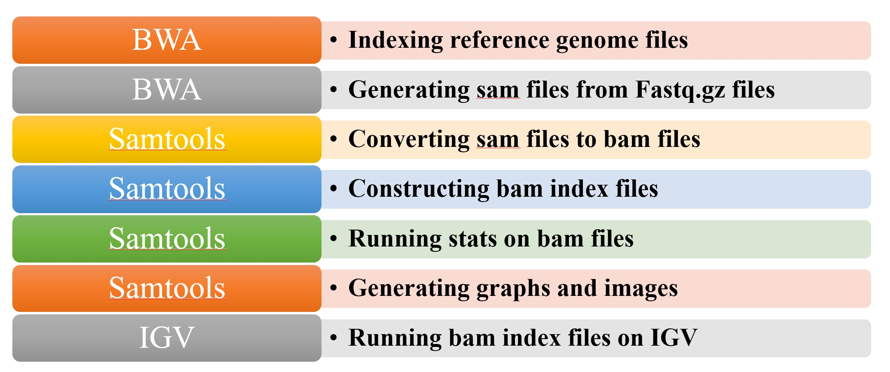

# gen711-811-Alignment of two Fragaria iinumae genomes 
## Background
### even smaller
We are interested in checking how accurate our pseudo chromosome assembly of Fragaria iinumae is and will check how well raw reads of the same species aligns to the reference genome. 
If there is poor alignment, then the pseudo chromosome assembly could be erroneous. 
If the alignment is good but there are still differences, then we can submit changes indicated by the raw reads to the pseudo chromosome assembly to further improve the assembly. 

Thomas Davis and Lise Mahoney et al. 2017 assembled the pesudo chromosome asembly of Fragaria iinumae in 2017 using Illumina Sequencing which is in pseudomolecules form and also Sequenced the raw reads from Fragaria iinumae in 2021 Using Oxford Nanopore which we compared. The raw reads are in its raw form (220 Fatsq.gz files).

## Methods
We accessed the Thomas Davis and Lise Mahoney et al. 2017 pesudochromosomes on a thinkmate in the Davis Lab at UNH. 

Our pesudochromosome and raw read files were in fastq.gz.

We installed bwa, samtools, and IGV with a conda environment.
Burrow Wheeler Alignment (BWA)is a software package for mapping low-divergent sequences against a large reference genome.

Samtools is a set of utilities that manipulate alignments in the SAM (Sequence Alignment/Map), BAM, and CRAM formats. 

Integrated Genome Viewer (IGV) is an interactive tool for the visual exploration of genomic data.

We ran our analysis on the thinkmate that stored the data. 

The Project pipeline:

### Issues and conclusion
The analysis resulted in poor coverage in the coverage vs number of mapped bases graph and the reference genome did not appear on the GC contenet [%] vs Normalized frequency graph as expected. Future work includes delving deeper and runing BWA with more reeds and figuring out why 2 graphs were abnormal as described.

    

## Commands used:
 2060  bwa mem FragariaPseudoChrsV2.fasta FAQ99085_pass_635cf375_2.fastq > sample4.sam
 2061  ls
 2062  less sample4.sam 
 2063  samtools view -S -b sample4.sam > sample4.bam
 2064  ls
 2065  less sample4.bam 
 2066  samtool stats sample4.bam > sample4.bam.stats
 2067  samtools stats sample4.bam > sample4.bam.stats
 2068  less sample4.bam.stats 
 2069  plot-bamstats -p my_output sample4.bam.stats 
 2070  less sample4.bam.stats 
 2071  plot-bamstats -p my_output sample4.bam.stats 
 2072  ls
 2073  samtools index sample4.bam sample4.bam.bai
 2074  samtools index sample4.bam sample4.bai
 2075  ls
 2076  samtools view sample4.bam | head
 2077  samtools sort sample4.bam -o sample4.sorted.bam
 2078  samtools view sample4.sorted.bam | head
 2079  samtools index sample4.sorted.bam

